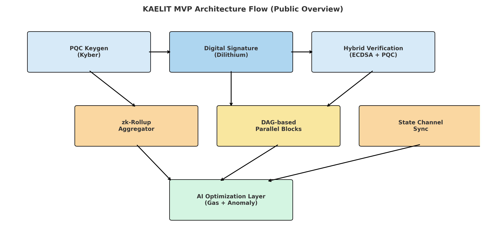

# KAELIT – Quantum-Secure, AI-Optimized Blockchain

> ⚠️ WARNING: This is the **only official GitHub repository of KAELIT**.  
> KAELIT is not affiliated with any tokens, coins, or blockchain forks claiming similar names.  
> Please verify through https://kaelit.com and our verified social channels before trusting any offers.

---
> 🚨 Legal Notice – Patent Protected  
> This architecture is protected under Korean patent application filed on 2025.04.15,  
> and an international PCT application has been officially filed.  
> Any unauthorized use, reproduction, or derivative work based on this system  
> may constitute patent infringement and will be subject to legal enforcement under international intellectual property law.

- [Architecture Snapshot (v0.2)](https://github.com/kaelitcom/kaelit-research/releases/tag/v0.2)
- [Architecture Snapshot (v0.1)](https://github.com/kaelitcom/kaelit-research/releases/tag/v0.1)

© KAELIT. All rights reserved.

---

# KAELIT — The Korean Bitcoin

A quantum-secure, AI-powered, zk-scalable blockchain — designed independently in Korea.

🔒 Post-Quantum Cryptography  
🧠 AI Network Optimization  
🧱 zk-Rollups + DAG  
🗓️ 20-Year Fixed Token Model

---

📘 Learn more: [WHY KAELIT](./WHY_KAELIT.md)  
🧠 Architecture: [ARCHITECTURE_OVERVIEW.md](./ARCHITECTURE_OVERVIEW.md)  
🌐 Website: [kaelit.com](https://kaelit.com)  
💬 Community: [discord.gg/6z4YjqVAyb](https://discord.gg/6z4YjqVAyb)

---

# KAELIT Research – High-Level Architecture Overview

This repository provides a public, conceptual overview of the KAELIT blockchain system.

## MVP Architecture Diagram

The following diagram illustrates KAELIT's high-level modular architecture,  
combining Post-Quantum Cryptography (PQC), zk-Rollups, DAG-based sharding, and Federated AI optimization.

---

## ⚠️ Legal & Intellectual Property Notice

All content in this repository is protected intellectual property, developed through deep research between 2022 and 2025 by **David Ahn**, founder of the KAELIT Project.

This repository is intentionally limited to a **high-level conceptual preview**.  
The following core components are **not publicly disclosed** and remain under strict internal control:

- Post-Quantum Cryptography (PQC) modules  
- zk-Rollup circuit implementations  
- DAG-based sharding architecture  
- AI optimization logic (Federated, LLM-based)

Any unauthorized use, reproduction, redistribution, or misrepresentation of this content will be considered **intentional IP infringement** and may result in international legal action.

---

## Intellectual Ownership

- Original Creator: **David Ahn** (Founder, KAELIT Project)  
- Research Period: **2022–2025**  
- GitHub Commit Timestamp: **April 13, 2025 (UTC)**  
- Authorship Proof: Stored and verifiable both on-chain and off-chain

---

## For Reviewers & Partners

If you represent a development firm, investment group, or blockchain lab interested in KAELIT’s architecture,  
please visit [kaelit.com](https://kaelit.com) or contact us via secure channels.  
Access to internal documentation is available under NDA.

---

## Copyright

© 2025 KAELIT Project — All rights reserved.  
Protected by international copyright law and blockchain timestamping.

